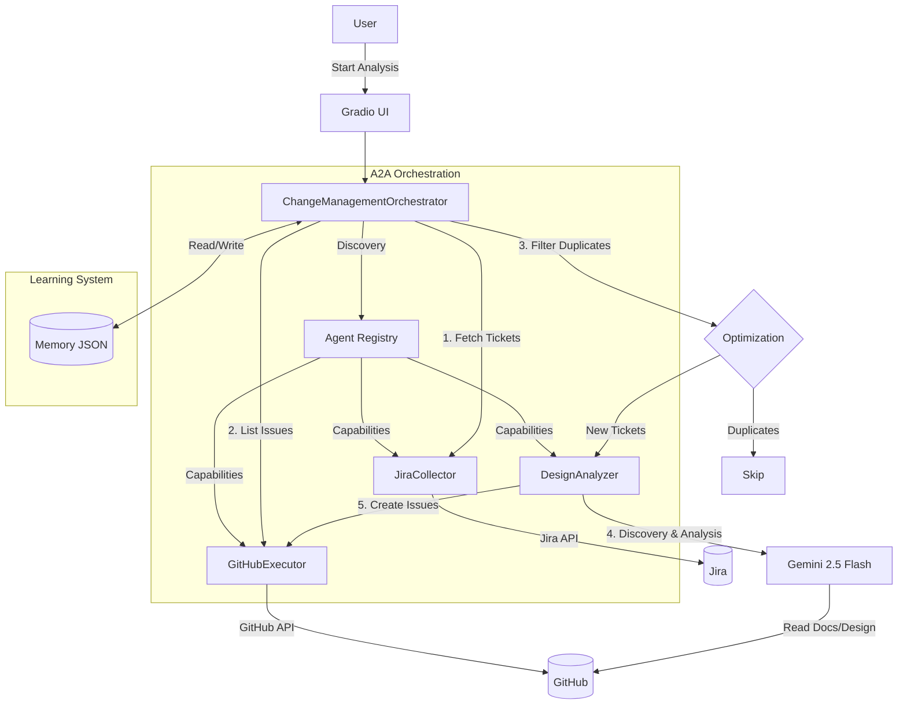

# Autonomous Change Management Assistant

An intelligent, multi-agent system designed to automate the software change management process. It orchestrates specialized agents to fetch Jira tickets, analyze their **design impact** on a GitHub codebase, and automatically create or update GitHub issues with detailed implementation plans.

## 🚀 Features

-   **Multi-Agent Architecture**: Built using **Google Agent Development Kit (ADK)**.
    -   **JiraCollector**: Fetches "To Do" and "In Progress" tickets from Jira.
    -   **DesignAnalyzer**: Uses **Gemini 2.5 Flash** to analyze the design impact on the repository.
        -   **Advanced Discovery**: Automatically explores the repo structure, finding design docs in `docs/` or root (e.g., `.md`, `.puml`).
        -   **Smart Context**: Uses an LLM to select the most relevant design files for context before analysis.
    -   **GitHubExecutor**: Manages GitHub issues (Listing & Creating).
-   **A2A Protocol Integration**: Implements **Agent Cards** for dynamic capability discovery and orchestration.
-   **Feedback & Learning**:
    -   **Memory**: Maintains a history of execution plans and outcomes in `orchestrator_memory.json`.
    -   **Adaptive Planning**: Uses past successful plans to inform and improve future orchestration.
-   **Smart Optimization**:
    -   **Duplicate Detection**: Checks existing GitHub issues before analyzing to prevent duplicates.
    -   **Cost Efficient**: Only analyzes new, unprocessed tickets.
-   **User-Friendly UI**: **Gradio** dashboard for easy interaction and real-time progress tracking.

## 🛠️ Prerequisites

-   **Python 3.10+**
-   **uv** (Fast Python package installer and resolver)
-   **Google API Key** (for Gemini)
-   **Atlassian Account** (Jira URL, Email, API Token)
-   **GitHub Account** (Personal Access Token)

## ⚙️ Setup

1.  **Clone the repository**:
    ```bash
    git clone <repository-url>
    cd Gradio
    ```

2.  **Set up the environment**:
    ```bash
    # Create virtual environment and install dependencies
    uv venv
    uv pip install -r requirements.txt
    ```

3.  **Configure Credentials**:
    Create a `.env` file in the root directory with the following:
    ```env
    GOOGLE_API_KEY=your_google_api_key
    JIRA_BASE_URL=https://your-site.atlassian.net
    JIRA_EMAIL=your_email@example.com
    JIRA_API_TOKEN=your_jira_api_token
    GITHUB_PERSONAL_ACCESS_TOKEN=your_github_pat
    ```

## 🏃‍♂️ Running the Application

Start the agent with the Gradio UI:

```bash
uv run python agent.py
```

The application will launch at `http://127.0.0.1:7860`.

## 🧠 Architecture



## 🤝 Contributing

1.  Fork the repository.
2.  Create a feature branch.
3.  Commit your changes.
4.  Push to the branch.
5.  Open a Pull Request.

## 📄 License

MIT
